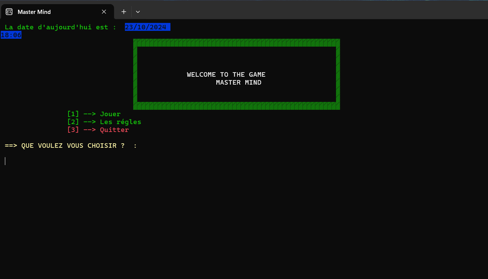
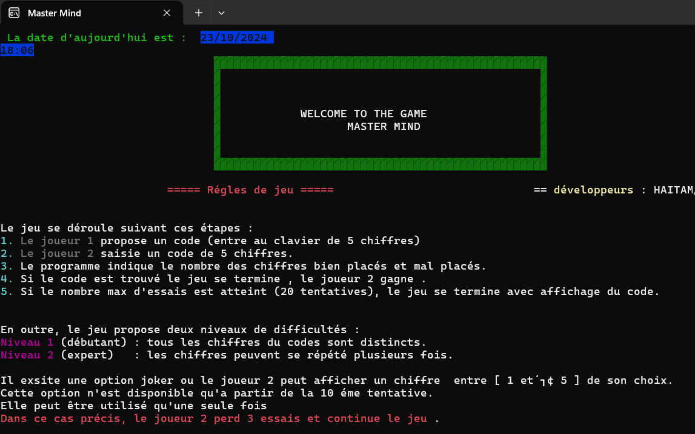
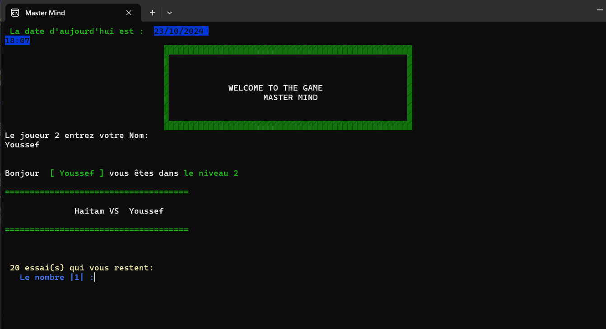
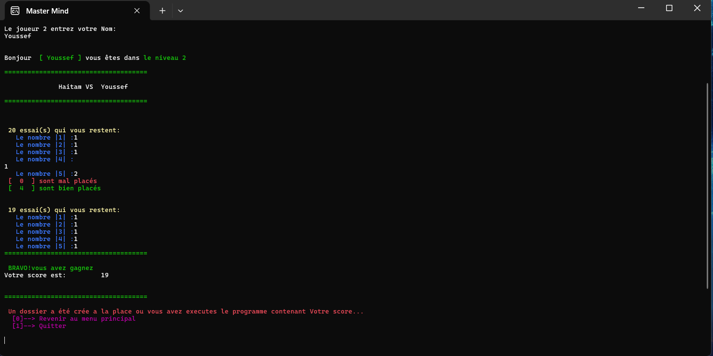

# MASTERMIND GAME

I am glad to introduce to you a simple Game Wrote in C language.
The idea of the game is very simple . Two players can play, the first one should write a sequence of numbers (five numbers) while the other player has to guess.
those numbers during 20 attempts
If he found the code, a folder would be created containing all the informations.
Thank you for your time.
If you have any question
Contact me:
www.fb.com/HaytamBenz5
Benzinanehaytam1@gmail.com

